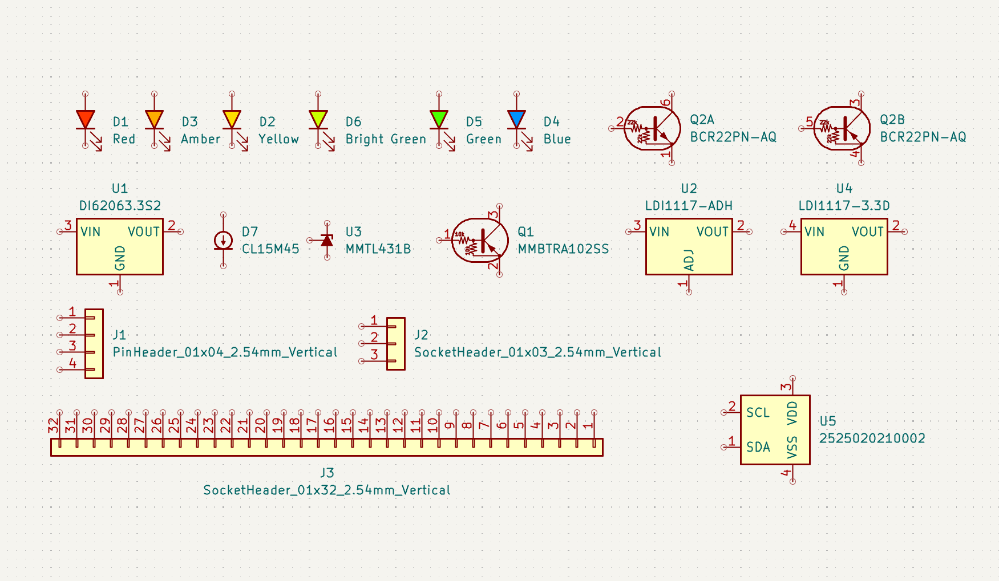

# AISLER Lovely Library
**A carefully curated collection of symbols and footprints.**



# Our Partners:

 


Quickly find parts from our partners Würth Elektronik and Diotec by component parameters or MPNs. All parts are fully specified, parameters like datasheet, footprint and MPN are preset for your convenience. When using parts from this library you are eligible for discounts on PCBs and PCBA when uploading your project to aisler.net

### Installation 

The simplest way to install AISLER’s Lovely Library is by using the Plugin and Content Manager (PCM). 

1. Download the [aisler-lovely-library.zip](https://github.com/AislerHQ/lovely-library/releases/) from the releases page. 
2. In KiCad, open the PCM in the main overview Window.
3. Install the library by selecting the ```.zip``` file trough "Install from File". 
4. You're Done! Note that the schematic libraries will have a ```PCM_``` prefix. 

### Motivation

The default KiCad library rarely provides fully specified symbols with orderable part numbers. Thus, users often do not specify a part number at all, resulting in additional support efforts when ordering assembled PCBs. We created this library to improve the development flow and encourage the usage of parts from our european component partners. 

This library is designed to augment the default library, not to replace it. As platinum sponsor we fully believe in KiCads mission and understand the importance of keeping the default library lean.
Our library is supposed to provide a seamless experience that abides to KiCad's standards and at the same time eases your development flo by adding relevant documentation for assembly and yourself. 

### License 

The Lovely Library is licensed under the [Creative Commons CC-BY-SA 4.0 License](https://creativecommons.org/licenses/by-sa/4.0/legalcode), with the following exception:

```
To the extent that the creation of electronic designs that use 'Licensed Material'
can be considered to be 'Adapted Material', then the copyright holder waives article 3
of the license with respect to these designs and any generated files which use data
provided as part of the 'Licensed Material'.
```

**Note:**  The AISLER, Würth Elektronik and Diotec branding & logos are registered trademarks of
AISLER B.V, Würth Elektronik eisos Gmbh & Co. KG and Diotec Semiconductor AG respectively
and not part of the library.  

### Warranty

AISLER provides the Lovely Library hoping to help developers, but without warranty of any kind, express or implied.

## About AISLER


AISLER Lovely Library is developed and funded by AISLER B.V.

Looking for quick and affordable manufacturing for your Electronic Project? Visit us at [AISLER](https://aisler.net)

